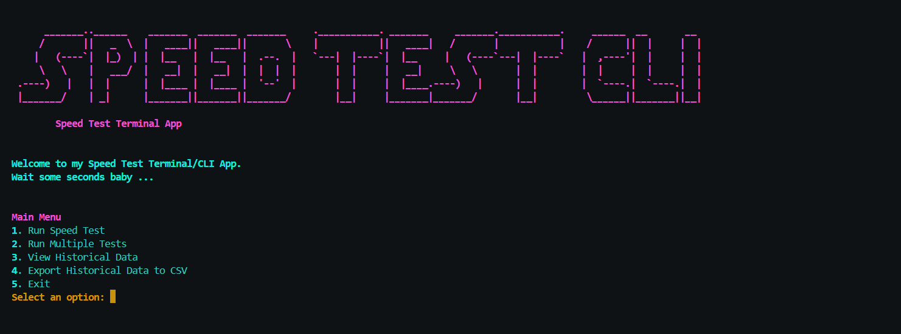
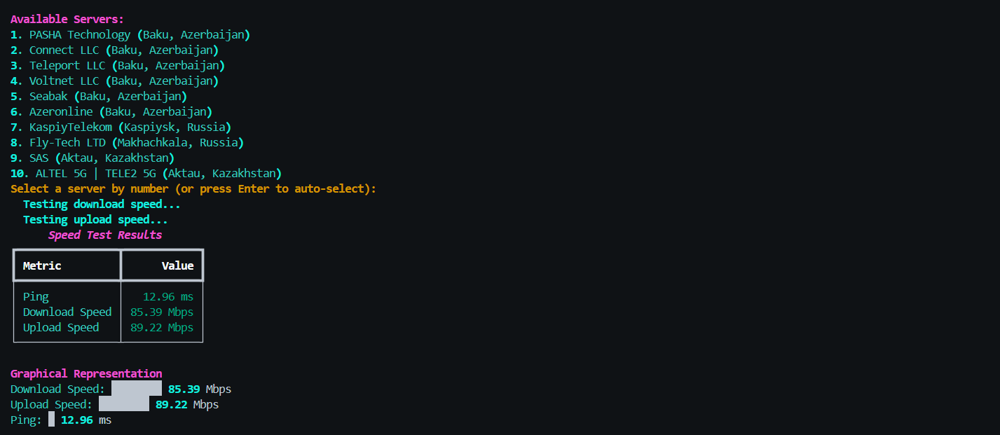

# Speed Test CLI

A terminal-based application to test your internet speed, view historical results, and export them to a CSV file. This tool provides a graphical and tabular representation of download speed, upload speed, and ping, and allows users to select specific servers for testing.

## Features

- Test your internet speed (download, upload, and ping).
- View a graphical and tabular summary of the results.
- Select specific servers for more accurate testing.
- Save results in JSON format for future reference.
- View historical data of past speed tests.
- Export historical data to a CSV file.
- Run multiple tests and calculate average results.

## Installation

1. Clone the repository:
   ```bash
   git clone https://github.com/s3bu7i/Speed-Test-CLI.git
   cd Speed-Test-CLI
   ```

2. Install the required dependencies:
   ```bash
   pip install -r requirements.txt
   ```

3. Run the application:
   ```bash
   python main.py
   ```

## Usage

### Main Menu Options

1. **Run Speed Test**: Perform a single speed test and view results.
2. **Run Multiple Tests**: Perform multiple speed tests and calculate average results.
3. **View Historical Data**: View saved results from previous tests.
4. **Export Historical Data to CSV**: Save historical data in a CSV file for analysis.
5. **Exit**: Close the application.

### Example Output

#### Speed Test Results
```plaintext
+-----------------+--------------------+
| Metric          | Value              |
+-----------------+--------------------+
| Ping            | 15 ms             |
| Download Speed  | 95 Mbps           |
| Upload Speed    | 12 Mbps           |
+-----------------+--------------------+

Graphical Representation:
Download Speed: ██████████ 95 Mbps
Upload Speed:   ████ 12 Mbps
Ping:           ███ 15 ms
```

### Historical Data
```plaintext
+---------------------+------------------+------------------+------+
| Date                | Download Speed   | Upload Speed     | Ping |
+---------------------+------------------+------------------+------+
| 2024-01-01 12:34:56 | 95 Mbps         | 12 Mbps          | 15 ms|
| 2024-01-02 14:22:10 | 80 Mbps         | 10 Mbps          | 20 ms|
+---------------------+------------------+------------------+------+
```

### Exported CSV Format
```csv
date,download,upload,ping
2024-01-01 12:34:56,95,12,15
2024-01-02 14:22:10,80,10,20
```

## Dependencies

- [speedtest-cli](https://pypi.org/project/speedtest-cli/)
- [rich](https://pypi.org/project/rich/)

To install these dependencies, run:
```bash
pip install speedtest-cli rich
```

## File Structure

```
Speed-Test-CLI/
├── speed_test_tool/
│   ├── __init__.py
│   ├── main.py       # Main program file
│   ├── utils.py      # Utility functions
├── requirements.txt  # Required dependencies
├── README.md         # Documentation
└── LICENSE           # License file
```

## Saving and Exporting Results

- **JSON**: Results are automatically saved in `speedtest_results.json`.
- **CSV**: Export results to `speedtest_results.csv` from the main menu.

## Troubleshooting

- Ensure Python 3.7 or later is installed.
- Install the dependencies using the `requirements.txt` file.
- If you encounter server selection issues, the app will default to auto-selecting the best server.

## License

This project is licensed under the MIT License. See the [LICENSE](LICENSE) file for details.

## Images

Here are some screenshots of the game in action:

